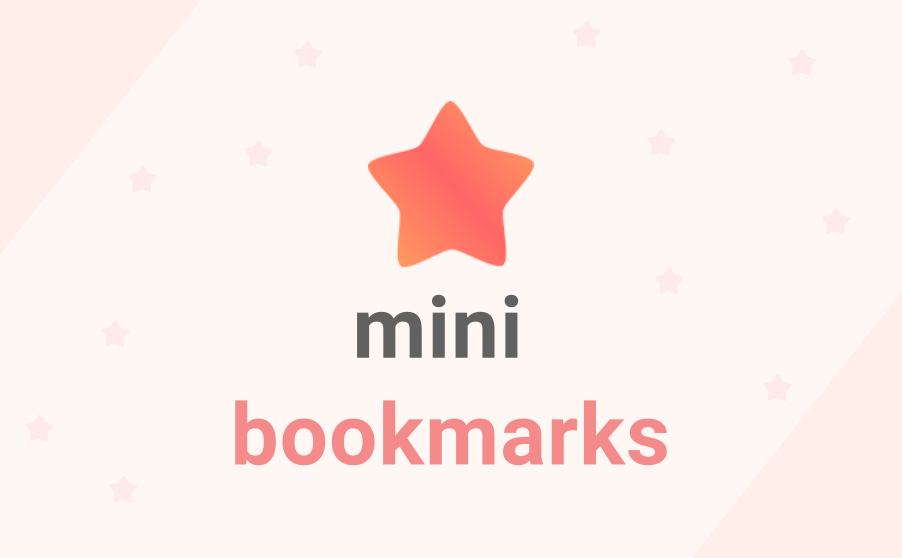
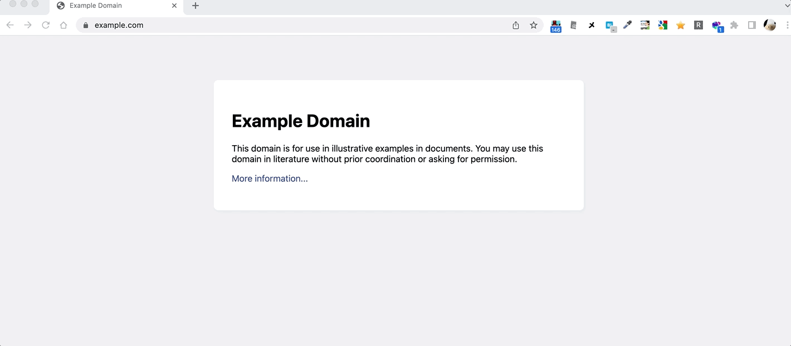

# Awesome Readlater

A Chrome extension for saving and managing articles to read later.

## Install

You can use it by installing it from the following URL.

https://chrome.google.com/webstore/detail/mini-bookmarks/lipgpfampommaphglnnnjjojidmkdlkn?hl=ja&authuser=0

## How to use

## Dev Environment

- node v20.3.1

## Contribution

If you have any requests, such as adding new features or fixing bugs, please report them through the Issue tracker. Your feedback is greatly appreciated!

Bug fixes and additions of tests in Pull Requests are highly welcome.

## License

- MIT